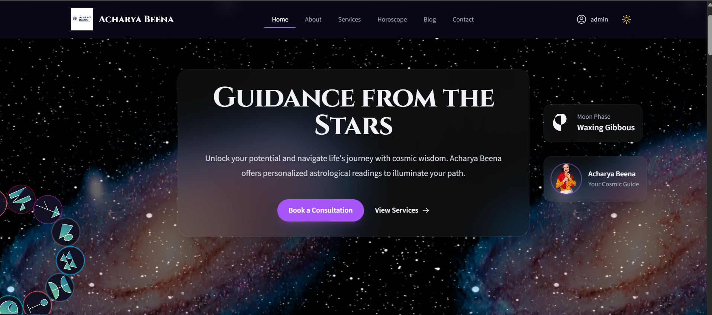

# Acharya Beena - Astrology Website

**Project Status:** Development Complete (Version 1.0)  
**Last Updated:** August 5, 2025

This is a full-stack **MERN** application built for **Acharya Beena**, a certified astrologer. The website serves as a professional platform to showcase her services, share astrology insights, and manage client bookings. It includes a complete public-facing website, a secure user system, and a powerful admin panel.

## 

## ✨ Features

This application is feature-rich, offering seamless user experience and comprehensive admin management tools.

### 🔮 User-Facing Features

- **Modern & Responsive Design**: Mobile-first, elegant UI across all devices.
- **Celestial Dark Theme**: Animated starry background with toggle support.
- **Static Pages**: Home, About, Services, Contact, Privacy Policy, Terms of Service.
- **Hard-Coded Blog**: Includes blog list view and single post pages.
- **Interactive Tools**:
  - **Horoscope Page**: Daily/weekly horoscopes for all 12 zodiac signs.
  - **Life Path Calculator**: Numerology-based life path discovery.
  - **Planetary Positions Widget**: Shows current planetary alignments on homepage.
- **SEO Optimized**: Unique meta tags using `react-helmet-async`.
- **PWA Ready**: Can be installed as a Progressive Web App.

### 👤 User Account & Booking

- **Secure Authentication**: Register/Login using JWT with hashed passwords.
- **User Dashboard**: View profile, booking history, and upcoming appointments.
- **Appointment Booking**: Multi-step flow with date/time picker.
- **Mock Payment Flow**: Simulated transaction experience for future integration.

### 🛡️ Admin Panel

- **Secure Admin Routes**: Accessible only to users with `admin` role.
- **Admin Dashboard**: Overview of total users, appointments, and revenue.
- **User Management (CRUD)**:
  - View, update, or delete users.
- **Booking Management (CRUD)**:
  - View all appointments.
  - Update statuses: Pending, Confirmed, Completed, Cancelled.

---

## 🛠️ Tech Stack

| Layer     | Tech                                                    |
| --------- | ------------------------------------------------------- |
| Frontend  | React (Vite), Tailwind CSS                              |
| Backend   | Node.js, Express.js                                     |
| Database  | MongoDB (with Mongoose)                                 |
| Auth      | JSON Web Tokens (JWT)                                   |
| Libraries | React Router, Nodemailer, React Datepicker, Headless UI |

---

## 🚀 Setup and Installation

### ✅ Prerequisites

- Node.js (v18+)
- MongoDB (local or Atlas)

### 📁 1. Clone the Repository

```bash
git clone <your-repository-url>
cd acharya-beena-website
```

### 🖥️ 2. Backend Setup

```bash
cd server
npm install
touch .env  # or manually create a .env file (see below)
npm run dev
```

> The backend runs on [http://localhost:5000](http://localhost:5000)

### 🌐 3. Frontend Setup

```bash
cd ../client
npm install
npm run dev
```

> The frontend runs on [http://localhost:5173](http://localhost:5173)

---

## ⚙️ Environment Variables

Create a `.env` file in the `/server` directory:

```env
# --- Server Configuration ---
PORT=5000
NODE_ENV=development

# --- Database ---
MONGO_URI=mongodb://127.0.0.1:27017/acharya-beena

# --- Authentication ---
JWT_SECRET=yourSuperSecretJwtKey

# --- Email (Nodemailer with Gmail) ---
EMAIL_HOST=smtp.gmail.com
EMAIL_PORT=587
EMAIL_USER=your-email-address@gmail.com
EMAIL_PASS=your-16-character-app-password
```

> 💡 To use Gmail with Nodemailer, generate a [Google App Password](https://support.google.com/accounts/answer/185833?hl=en) and enable "Less secure app access" if needed.

---

## 📸 Screenshots

_Add screenshots of the home page, dashboard, booking system, etc._

---

## 📄 License

This project is licensed for use by Acharya Beena. For custom builds or collaborations, please contact the developer.

---

## 👩‍💻 Developer

Built with ❤️ by [Shubham Pawale](https://www.shubhampawale.info)
